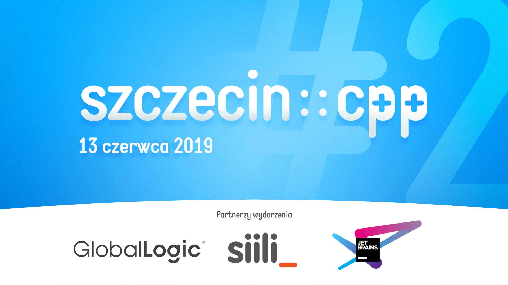

## szczecin::cpp #2

Prezentacje:
* Marcin Ławicki: **C++ Modules** ([PDF](#))
* Thomas Geymayer: **Modern CMake. It's time to do it right.** ([PDF](#))

Partnerzy wydarzenia:
* [GlobalLogic](https://www.globallogic.com)
* [Siili Solutions](https://www.siili.com)
* [JetBrains](https://www.jetbrains.com)
